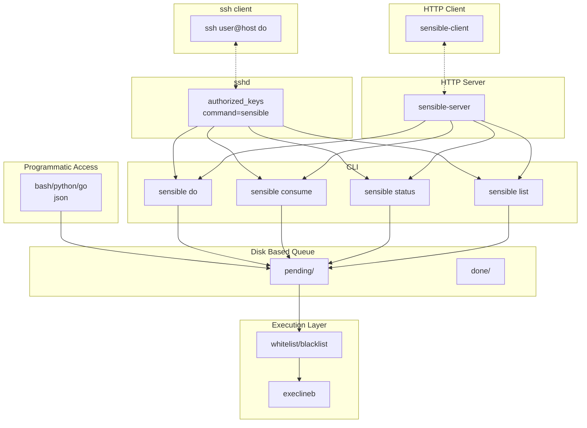

# Sensible - Secure Remote Actions (not Ansible!)

https://youtube.com/shorts/UlftjpdjisY?si=FSgbIbHmu7ZgdACm

## Sensible - Remote Monitoring/Management Agent

Sensible provides secure remote command execution for AI agents using a queue-based system:

- **Protocol** - ssh (secured using forced-command) / REST-API
- **AI agents** queue `execline scripts` to run on remote **hosts**
- **Queue** stores tasks as JSON files (`pending/` → `done/`)
- **Filter** (whitelist/blacklist) simple effective and efficient validation
- **Execlineb** executes scripts safely — no shell injection, no `$VAR` expansion

## Sensible - Container Agent -> Host Actions

Container signals host to execute allowed `execline scripts`. 
**Key benefit:** AI can trigger host actions (build, deploy, restart) without SSH/Shell/Socket access.

## Architecture Layers



**Layers (top to bottom):**
1. **Clients** — SSH client | HTTP sensible-client
2. **Server** — sshd | HTTP server endpoint -> sensible-server port
3. **CLI** — `do`, `consume`, `status`, `list` | **Programmatic** bash/python/go (json)
4. **Queue** — disk queue (`pending/` → `done/`)
5. **Security Filter** - whitelist/blacklist
6. **Execution** — execlineb (runs the scripts)

## Quick Start

```bash
# Install
make install-user

# Enqueue scripts
sensible do "echo hello"
sensible do "make build"

# Process queue (oneshot - exits when done)
sensible consume

# Stays alive, watches for new tasks
sensible consume -t 60m
# Or run as daemon
sensible consume --start 
# Stop with:
sensible consume --stop

# Check results
sensible list
sensible status <file_id>
```

## SSH Setup (AI Identity)

Give an AI restricted access to run sensible via SSH on admin's account:

```bash
# On host: install sensible
make install-user

# On host: copy default config to user's .config
mkdir -p ~/.config/sensible
cp examples/06-ai-monitoring.json ~/.config/sensible/config.json

# On host: create AI identity key
ssh-keygen -t ed25519 -f ~/.ssh/ai_agent_key -N "" -C "ai-agent"

# On host: add to admin's authorized_keys (restrict to sensible binary only)
cat ~/.ssh/ai_agent_key.pub >> ~/.ssh/authorized_keys

# Edit authorized_keys to restrict:
# In ~/.ssh/authorized_keys (one line):
command="/usr/local/bin/sensible",no-pty,no-agent-forwarding,no-X11-forwarding ssh-ed25519 AAAA...ai-agent
```

Now the AI can trigger work via SSH:

```bash
# Queue work to host
ssh -i ~/.ssh/ai_agent_key admin@host sensible do "make build"

# Trigger consume on host
ssh -i ~/.ssh/ai_agent_key admin@host sensible consume
```

- The SSH key can only invoke the `sensible` binary, not arbitrary commands
- Validation happens at `consume` time against host's config

## Why execline?

Shell is fundamentally unsafe for AI execution. Execline provides guardrails:

- No `$VAR` interpolation (use `import -env` explicitly)
- No command chaining with `;` or `&&`
- No `-c` option to execute strings

Even with whitelist bypass, execline prevents shell injection.

## Commands

| Command | Description |
|---------|-------------|
| `sensible-do <script> [<script>...]` | Enqueue execlineb script(s), chains implicitly |
| `sensible-consume [options]` | Process queue (see consume modes below) |
| `sensible-status <file_id> [field]` | Check task result (JSON or specific field) |
| `sensible-list` | List pending tasks |

### Consume Modes

```bash
# Oneshot - process all and exit
sensible consume

# Daemon - run forever (watching for new tasks)
sensible consume -t 0
sensible consume --start

# Timed - exit after idle timeout
sensible consume -t 5m

# Stop a running consume
sensible consume --stop
```

- **oneshot**: Process all pending tasks, then exit
- **daemon** (`-t 0` or `--start`): Run forever, watch for new tasks, stop file exits
- **timed** (`-t <duration>`): Run until idle for the specified duration
- **--stop**: Create stop file to gracefully stop a running consume

The stop file is at `${SENSIBLE_TASKS_DIR}/pending/stop`. Creating it causes consume to exit cleanly.

### Chaining

```bash
sensible-do "compile" "test" "deploy"
```

Creates dependency chain: `compile` → `test` → `deploy`

### Fallback (||)

```bash
sensible-do "build" "||" "build-alternative"
sensible-do "build" "||" "build-alt" "deploy"
```

- `||` as separate argument combines two scripts into single task
- Wraps as: `"ifelse { build } { } { build-alternative }"`
- If `build` succeeds, chain stops (fallback not run)
- If `build` fails, `build-alternative` runs (in same task)
- Supports chaining: fallback task can have `run_next` to subsequent tasks

### Chain on success (&&)

```bash
sensible-do "build" "&&" "test" "deploy"
```

- `&&` is ignored - chain logic already handles success continuation via `run_next`
- Semantically documents intent that `test` only runs if `build` succeeds

### Status

### Status

```bash
sensible-status <file_id>          # JSON output
sensible-status <file_id> stdout   # verbatim stdout
sensible-status <file_id> status   # just the status value
```

## Configuration

Config file: `/etc/sensible/config.json` or `~/.config/sensible/config.json`

```json
{
  "whitelist": ["^podman commit", "^podman rmi", "^podman tag", "^podman restart"],
  "blacklist": ["^.*"]
}
```

- Regex patterns for fine-grained control
- Whitelist takes precedence over blacklist
- Empty whitelist = all allowed

## Systemd Setup (User Units)

```bash
# User units (recommended)
cd systemd-path-user && ./setup.sh

# Or system units (requires root)
cd systemd-path-system && sudo ./setup.sh
```

The path unit watches `pending/` directory. New file triggers `sensible consume` via the wrapper.

## Remote Access

Two options for remote execution:

### SSH

Lock down SSH to only allow sensible commands via forced command:

```bash
# In ~/.ssh/authorized_keys on host:
command="/usr/local/bin/sensible" ssh-rsa AAAA...
```

```bash
ssh host do "echo hello"     # → sensible do "echo hello"
ssh host status <file_id>    # → sensible status <file_id>
ssh host list                # → sensible list
```

Lock to specific subcommand:
```bash
command="/usr/local/bin/sensible do" ssh-rsa AAAA...
```

### HTTP/JSON

```bash
# Host: start server
sensible-server

# Container: use client
sensible-client do "echo hello"
sensible-client status <file_id>
```

Server supports API key authentication via `Authorization: Bearer <key>`.

## Directory Structure

```
${SENSIBLE_TASKS_DIR}/
├── pending/                    # Tasks waiting to execute
│   └── 2026-04-30T12:00:00.123456789Z-script-1.json
└── done/                       # Completed tasks
    └── 2026-04-30T12:00:05.987654321Z-script-1.json
```

## Installation

```bash
# User installation (no sudo)
make install-user

# System installation (requires sudo)
sudo make install-system
```

User install creates:
```
~/.local/bin/sensible              # wrapper
~/.local/lib/sensible/             # subcommands
~/.config/sensible/config.json     # config
```

System install creates:
```
/usr/local/bin/sensible
/usr/local/lib/sensible/
/etc/sensible/config.json
```

## Building

```bash
make build          # Build all binaries to build/
make test           # Run tests (Go + bash-spec)
```

## Project Structure

```
sensible/
├── cmd/
│   ├── sensible-do/        # Enqueue scripts
│   ├── sensible-consume/   # Worker
│   ├── sensible-status/    # Check result
│   └── sensible-list/      # List pending
├── pkg/sensible/          # Library
├── systemd-path-user/      # User systemd units
├── systemd-path-system/    # System systemd units
└── tests/                  # bash-spec 2.1 tests
```

## Testing

```bash
make test           # Go tests + bash-spec tests
bash tests/config_spec.sh  # Just bash tests
```

## Appendix: Additional Features

### Remote Installation via Self-Extracting Archive (Planned)

Sensible will be distributed as a self-extracting archive using `makeself` for easy remote installation:

```bash
# Download and run on target host
./sensible-latest-x86_64.sh
```

## License

MIT
